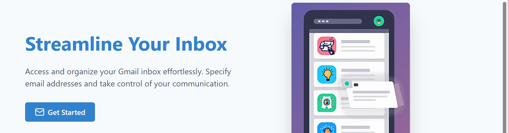

# Gmail Organizer



Gmail Organizer is a tool designed to help users manage their Gmail accounts more efficiently by filtering and organizing emails based on a user-defined list of allowed sender addresses. This app allows users to focus on important emails by only displaying messages from approved senders.

## Features

- Set up a list of allowed email addresses
- Filter incoming emails to show only those from allowed senders
- Add new email addresses to the allowed list
- Remove email addresses from the allowed list
- Backend integration for persistent storage of allowed email lists

## Installation

1. Clone the repository:
```javascript
    git clone https://github.com/yourusername/gmail-organizer.git
```
2. Navigate to the project directory:
```javascript
    cd gmail-organizer
```
3. Install dependencies:
```javascript
    npm install
```

## Usage

To use the Gmail Organizer, you'll need to set up both the frontend and backend components.

### Backend Setup

1. Ensure you have a backend server running on `http://localhost:5001`.
2. The backend should support the following endpoints:
- GET `/user/:userId/allowed-emails`
- POST `/user/:userId/allowed-emails`
- DELETE `/user/:userId/allowed-emails`

### Frontend Usage

The `filestorage.js` file provides functions to interact with the backend:

- `getAllowedEmails(userId)`: Retrieves the list of allowed email addresses for a user.
- `addAllowedEmail(userId, email)`: Adds a new email address to the allowed list.
- `removeAllowedEmail(userId, email)`: Removes an email address from the allowed list.

Example usage:

```javascript
import { getAllowedEmails, addAllowedEmail, removeAllowedEmail } from './filestorage';

// Get allowed emails
const allowedEmails = await getAllowedEmails('user123');

// Add a new allowed email
await addAllowedEmail('user123', 'newuser@example.com');

// Remove an allowed email
await removeAllowedEmail('user123', 'olduser@example.com');
```

## How It Works

1. Users set up their list of allowed email addresses through the app interface.
2. The app connects to the user's Gmail account        (implementation details to be added).
3. When fetching emails, the app filters the inbox to display only emails from the allowed list of senders.
4. Users can easily manage their allowed list, adding or removing email addresses as needed.

## Contributing
Contributions are welcome! Please feel free to submit a Pull Request.

## License
[Add your chosen license here]

## Contact
[Add your contact information here]